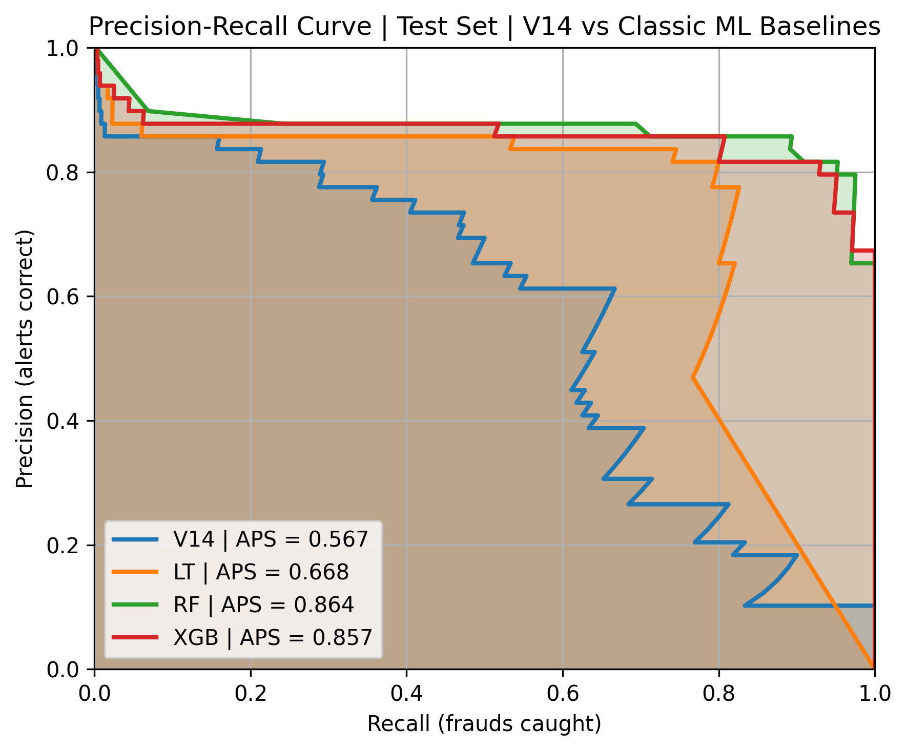

# Credit Card Fraud Detection

Start with the full write-up: [credit-card-fraud-detection.md](credit-card-fraud-detection.md)

## Project Overview

- Hands-on exploration of Kaggle’s credit card fraud dataset with EDA and classic ML baselines tailored for extreme class imbalance.
- Dataset: 284,807 transactions with 0.172% fraud; PCA features V1–V28 plus raw `Time` and `Amount`.
- Emphasis on AUPRC, threshold tuning, and precision/recall trade-offs over misleading accuracy.
- Deliverables: Jupyter [notebooks](notebooks/), reproducible `uv` env, cleaned dataset, figures in `results/`, and a narrative write-up.

## Results Summary

| Model | PR-AUC |
| :---: | :---: | 
| Logistic Regression |0.764  |
| Random Forest |0.869|
| XGBoost |0.911|



## Quick Start

Prereqs: Python 3.11–3.12, Git.

Install uv (choose one):

```bash
# macOS/Linux
curl -LsSf https://astral.sh/uv/install.sh | sh

# macOS (Homebrew)
brew install uv

# Windows (PowerShell)
iwr https://astral.sh/uv/install.ps1 -UseBasicParsing | iex
```

Create env and install dependencies (uses `pyproject.toml` + `uv.lock`):

```bash
uv sync
```

Launch Jupyter Lab:

```bash
uv run jupyter lab
```

## Notebooks

- `notebooks/01_eda.ipynb` — exploratory data analysis and preprocessing; saves cleaned data to `data/processed/creditcard_clean.csv`.
- `notebooks/02_ml_baselines.ipynb` — baseline models and evaluation.

## Data Setup

- Source dataset: Kaggle — Credit Card Fraud Detection (mlg-ulb/creditcardfraud).
- Expected raw CSV path: `data/raw/creditcard.csv` (the notebooks read this).
- Options to get the data into place:
  - Manual: download from Kaggle and place `creditcard.csv` at `data/raw/creditcard.csv`.
  - Kaggle CLI (requires an API token configured):

```bash
uv run kaggle datasets download -d mlg-ulb/creditcardfraud -p data/raw
unzip data/raw/creditcardfraud.zip -d data/raw
```

## Project Structure

- `notebooks/` — EDA and modeling notebooks.
- `data/` — `raw/`, `processed/`, and `interim/` data folders (CSV paths used by notebooks).
- `results/` — figures and artifacts written by analysis.
- `project_utils/` — helper utilities (e.g., `autosave_plots.py`).
- `main.py` — minimal entrypoint placeholder.

## Plot Autosave (optional)

Auto-save Matplotlib figures from notebooks into `results/`:

```python
from project_utils.autosave_plots import enable_autosave
enable_autosave("eda")  # figures go to results/eda
```

To mirror figures to a personal Obsidian vault, set env var `AILAB_OBSIDIAN_RESULTS` to your vault path before starting Jupyter.

## Developer Tips

Run linters/formatters via uv:

```bash
uv run ruff check .
uv run mypy .
```

Pre-commit (optional):

```bash
uv run pre-commit install
uv run pre-commit run --all-files
```

## Python Compatibility

Project requires Python `>=3.11,<3.13` (see `pyproject.toml`). If needed, have uv manage a specific Python:

```bash
uv python install 3.12
uv python pin 3.12
uv sync
```

## Run As Script (optional)

```bash
uv run python main.py
```

## License

MIT
