# Credit Card Fraud Detection
In this post, I’ll go over a credit card fraud detection dataset and implement models to detect fraud. I’ll start off with exploratory analysis, implement some ML baselines and enhance with LLM features. Finally, I’ll compare accuracy using both methods.

## Exploratory Data Analysis

First, we need some info on the actual dataset itself. From the [official](https://www.kaggle.com/datasets/mlg-ulb/creditcardfraud) Kaggle documentation of the dataset:

> The dataset contains transactions made by credit cards in September 2013 by European cardholders. This dataset presents transactions that occurred in two days, where we have 492 frauds out of 284,807 transactions. The dataset is highly unbalanced, the positive class (frauds) account for 0.172% of all transactions.

> It contains only numerical input variables which are the result of a PCA transformation. Unfortunately, due to confidentiality issues, we cannot provide the original features and more background information about the data. Features V1, V2, … V28 are the principal components obtained with PCA, the only features which have not been transformed with PCA are ‘Time’ and ‘Amount’. Feature ‘Time’ contains the seconds elapsed between each transaction and the first transaction in the dataset. The feature ‘Amount’ is the transaction Amount, this feature can be used for example-dependant cost-sensitive learning. Feature ‘Class’ is the response variable and it takes value 1 in case of fraud and 0 otherwise.

> Given the class imbalance ratio, we recommend measuring the accuracy using the Area Under the Precision-Recall Curve (AUPRC). Confusion matrix accuracy is not meaningful for unbalanced classification.

We can start by loading the dataset in python and doing some basic shape checks

```
((284807, 31),
 Time      float64
 V1        float64
 V2        float64
 ...
 V27       float64
 V28       float64
 Amount    float64
 Class       int64
 dtype: object)
```

You can see there are no labelled features, but rather a series of $V_i$  — a result of [principal component analysis](https://en.wikipedia.org/wiki/Principal_component_analysis) to transform the original dataset into a linear combination of the original variables. This is usually done to mask PII (such as customer IDs or transaction location). This is privacy-compliant as we cannot reverse engineer the components to get to the raw data. While there is some loss of domain-specific information that will impact model quality, we still have meaningful numerical signals to play with.

Let’s validate the class imbalance.
### Validate class imbalance

 ```
 Class
Non-fraud    284315
Fraud           492
Name: count, dtype: int64
​
Fraud ratio: 0.1727%
```
Only 0.17% of transactions are fraudulent, making the dataset **extremely imbalanced**.

Next let’s analyze the features that _haven’t_ been PCA’d (`Amount` and `Time`).
### Exploring `Amount`
 `Amount` is the transaction amount. A quick plot shows that `Amount` is highly skewed.
 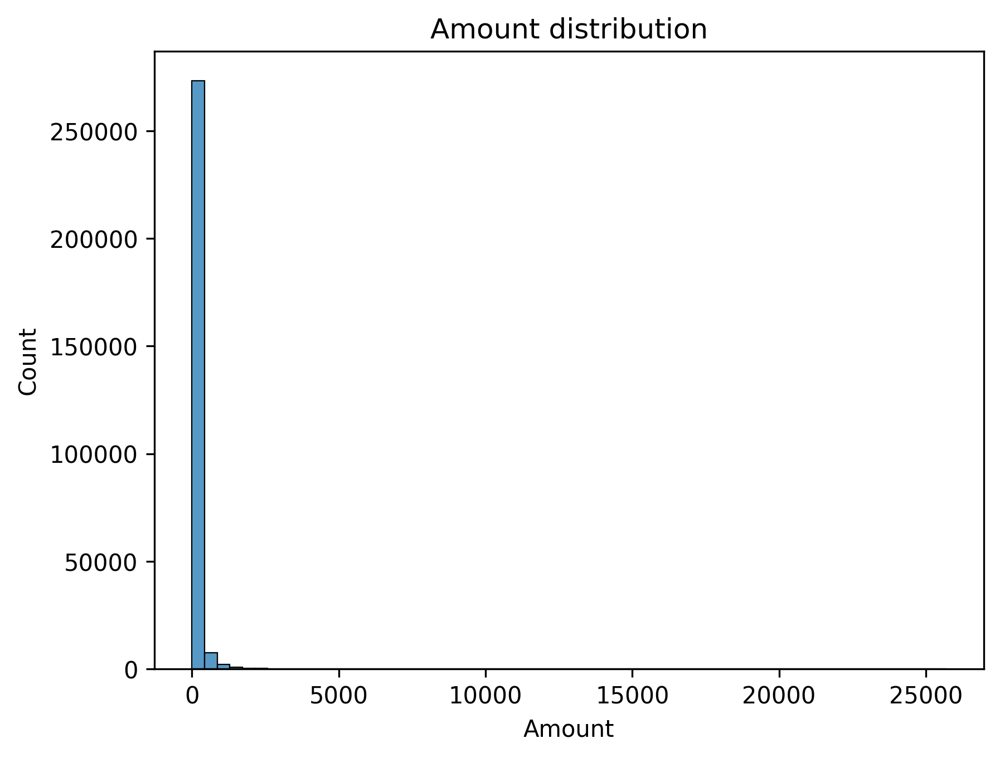

We can validate the skewness of the sample by calculating the Fisher-Pearson coefficient of [skewness](https://docs.scipy.org/doc/scipy/reference/generated/scipy.stats.skew.html) $G_1$.
```
Raw Amount skew: 16.97763503663313
```
This is pretty high, considering that $G_1$ should be close to 0 for a perfectly normal distribution. This non-normality can hurt us in statistical tests or modeling so it's best if we normalize the data. We can do this by log-transforming the dataset to reduce skew. Log-transformation translates multiplicative effects to additive effects, making the result suitable for models that assume linearity of data. Log-transformation simply takes the $\log(x)$ of each value $x$. Since `Amount` can be close to 0, it's safer to do $\log(1+x)$.
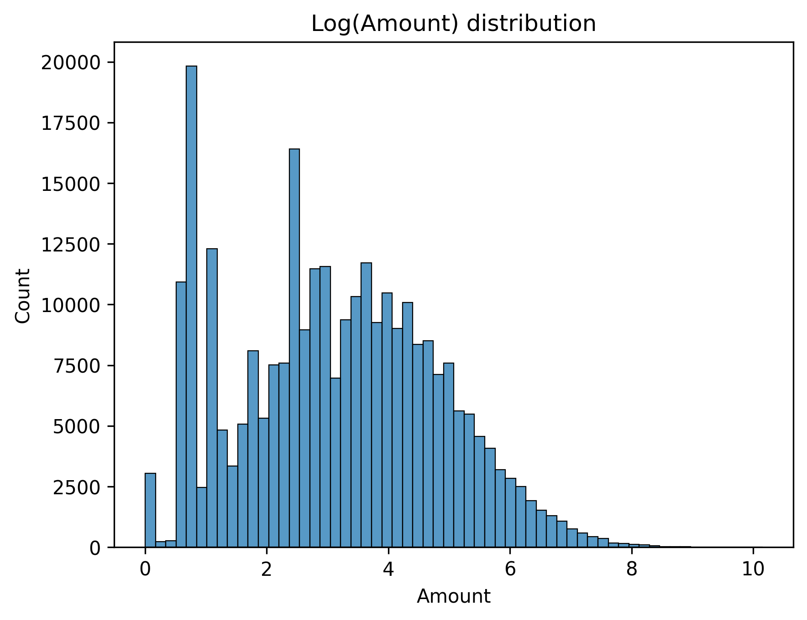

This looks much more symmetrical. We can validate the effects on skew as well.
```
Log-transformed Amount skew: 0.16270207082889332
```
The log-transformed field has skew closer to normality, as evidenced by $G_1\approx0.16$.

A side-by-side comparison is also helpful here to see the scale in improvement.

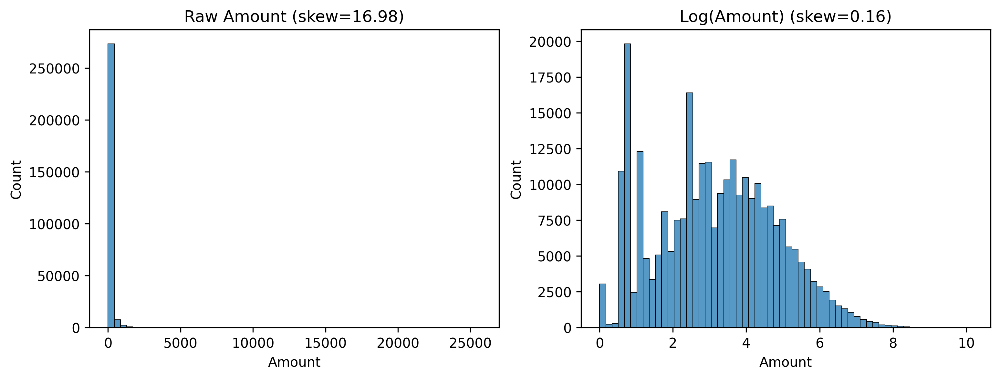
### Exploring `Time`
`Time` is the time elapsed since the first transaction (in seconds). We can do a quick visual check of the first 1000 samples (since this is too large of a dataset to plot).

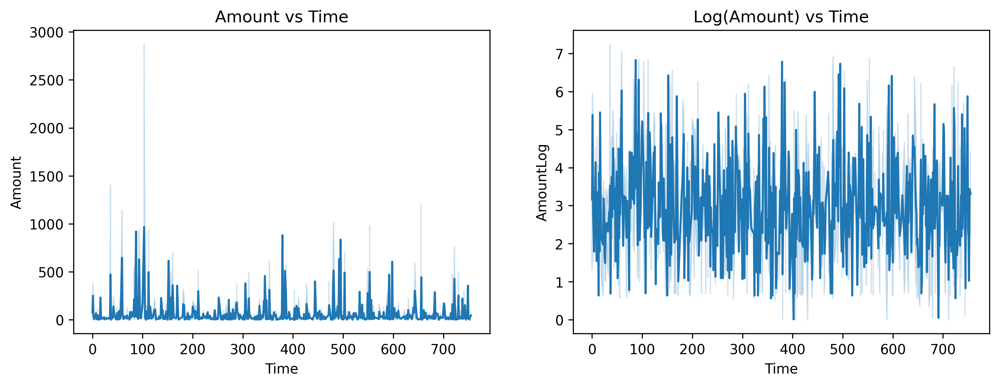
"Time since the first transaction" isn't a helpful real-world signal so we need to convert this into something more practical. The actual time is likely a better predictor of fraud occurrence. Note that the dataset doesn't actually tell you what time `0` actually is, so it's better to convert this into a cyclical signal (like minutes of the day). For posterity, we can assume that `0` is exactly midnight and so `60` will be 01:00 AM. The actual anchor time doesn't really matter – we just want a practical transformation to predict things like "fraud peaks at 2:03 AM".
```python
df['MinuteOfDay'] = ((df['Time'] % (24*3600)) / 60).astype(int)
```
Let's redo the plot to get a better visual sense of the transformation.

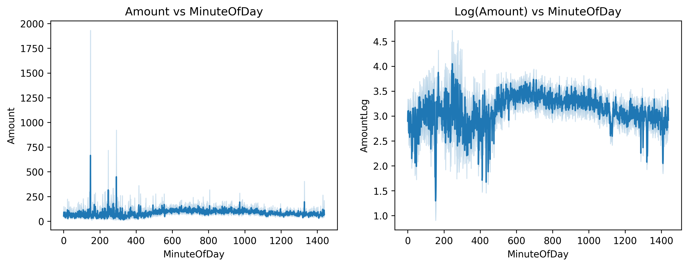
### Class Separation
Now that we've normalized our features, we can start visually inspecting them to see if there are any interesting class separations. It's easiest to start with some fraud vs non-fraud overlays. We overlay fraud vs non-fraud kernel density plots to look for class separation.

I won't show every plot here, but let's see `AmountLog` for starters.
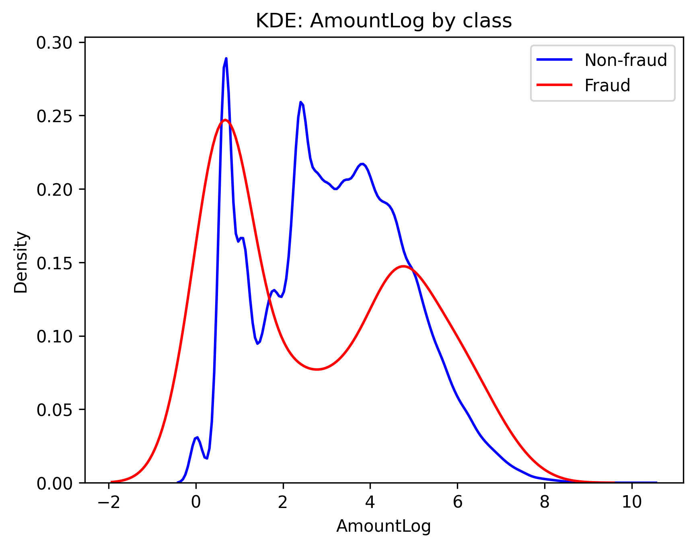
Fraud transactions seem to cluster at low transaction amounts (0) and then at higher transaction amounts (~5). This could explain two types of fraudulent transactions: small test amounts and larger amounts that do real damage. However, there's no clear distinction in distribution compared to non-fraud transactions, so `Amount` isn't sufficient to parse out interesting classes.

Let's look at some more examples.
- V15 shows an almost perfect overlap meaning it's not useful in isolation.
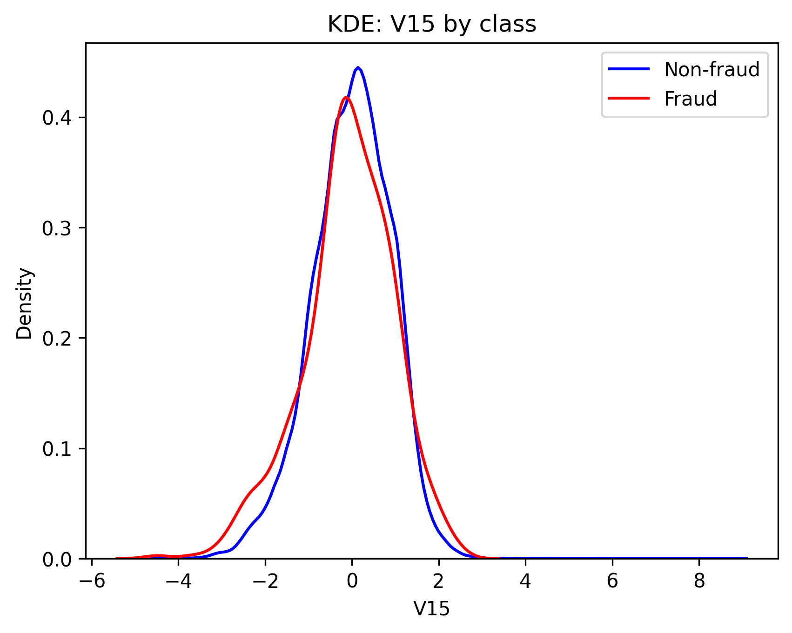
- V11 and V14 show distinct separation. If V11 > 1 or V14 < 5, there's a strong chance the transaction is fraudulent.
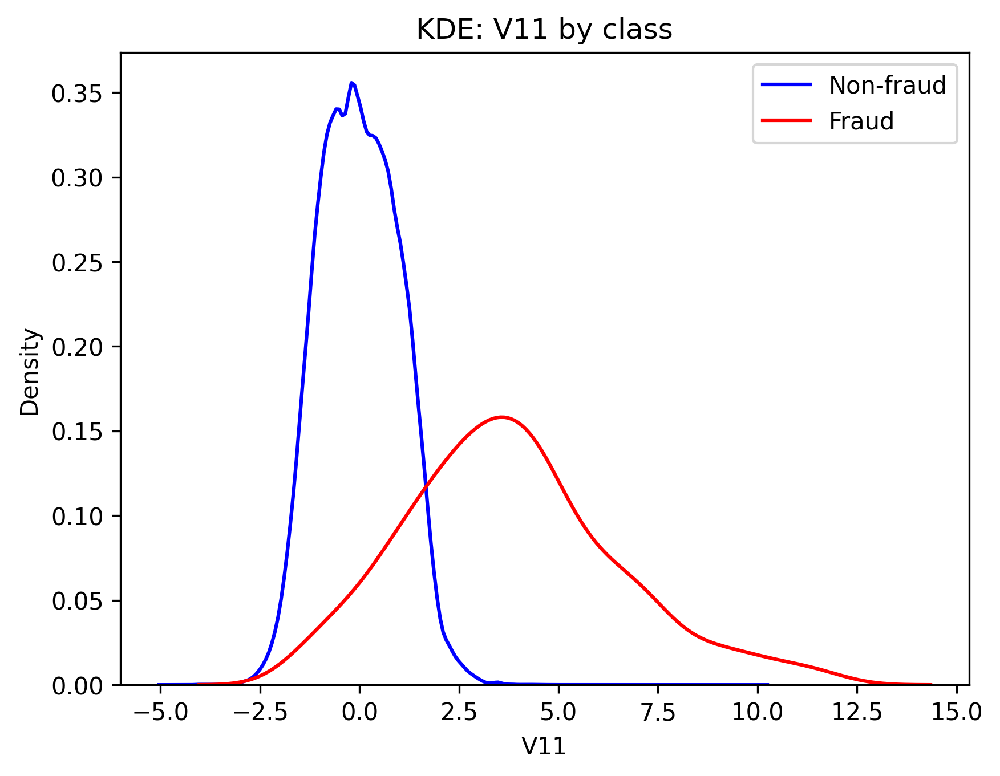
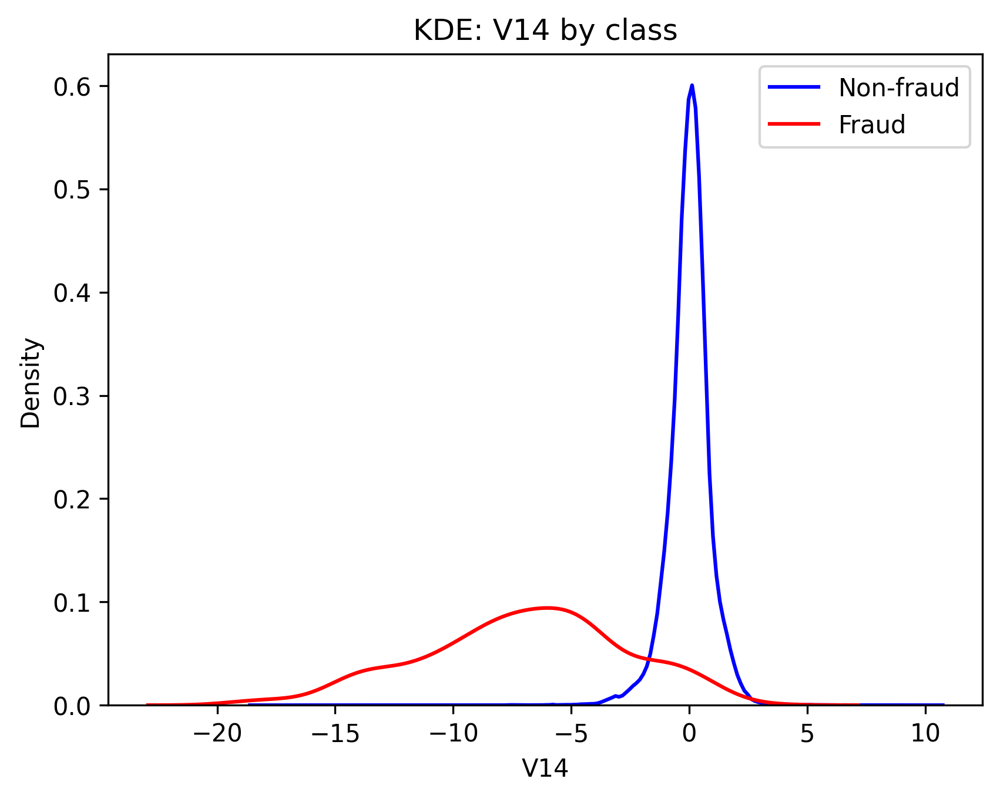
#### AUPRC
While a visual indicator like this is helpful, it's impractical to inspect every feature. That's exactly where we can use MLG's (the dataset owner's) recommendation Area Under the Precision-Recall Curve (AUPRC) [^1] to check for each feature's discriminatory power.

Let's calculate and plot the average precision score.


V15 has a very low score while V11 has a high score, validating our visual assessment. But V14 seems to defy our expectation! The high discriminatory power we saw in the plot isn't reflected in the precision. This is because of the way AUPRC is defined - it assumes that that the higher value of the feature represents higher probability that the transaction is a fraud. But in V14, we see that the mean of the fraud values is actually lower than the mean of the non-fraud values, which is tripping up the AUPRC function.

We can reverse this by setting such features as negative (where mean of the fraud features is less than the mean of the non-fraud features). Here's a small modification of the plot above.
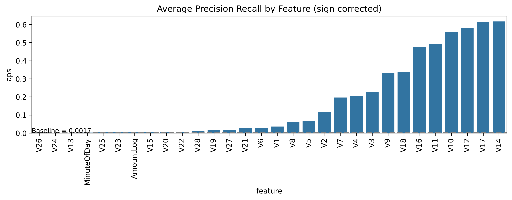
This aligns with what we saw in the KDE plots.

Let's interpret these scores. The fraud rate in the dataset is 0.172% so a random classifier will predict fraud with 0.172% accuracy. Showing this on the chart above is hard because the baseline is so small, so lets log-scale everything to visualize better.
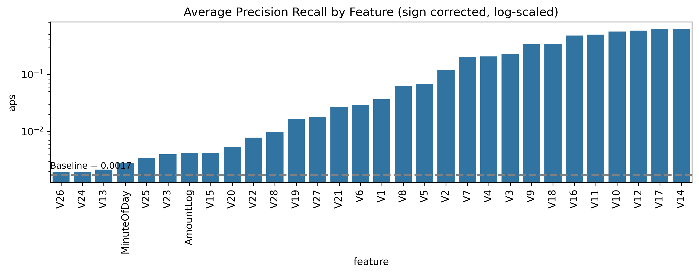
All the features have a higher precision score than the baseline, so *individually*, they are better than random chance in predicting fraud. The best feature (V14) has a score of 0.617, which is 360x better than random chance in precisely detecting fraud.
### Summary
The dataset was heavily imbalanced with only 0.17% of transactions being marked as fraud. We normalized the data by log-transforming the amount and transforming the “time since first transaction” to a more real-world signal (minute of the day) to take advantage of the temporal nature of frauds. We further analyzed class separation by first inspecting visually to gain a sense of the features using kernel density estimates, and then calculating the AUPRC (area under the precision-recall curve). We further sign-corrected features to align with our visual inspection and determined isolated features, ranking them by their precision score in finding fraud. The best feature is 360x more precise than random chance in predicting fraud.

But, we can do better.
# Classic Machine Learning Baselines

We'll use some classic ML models to predict fraud. First we'll load the cleaned up dataset and set a seed for repeatability.

## Create training/validation/training datasets
Before we can start applying ML models, we need to split the data into training, validation and test datasets. The training and validation data will be used to train and improve our model while the test dataset is a "blind" dataset that our model has never seen (we'll use this to actually test the final model). A good rule-of-thumb i like to use is 80/10/10 split to generate the datasets.

Let's check the distribution of fraud.
```
Train: 227845 samples, 0.173% fraud
Validation: 28481 samples, 0.151% fraud
Test: 28481 samples, 0.193% fraud
Shapes: X_train=(227845, 30), X_validation=(28481, 30), X_test=(28481, 30)
```
### Stratified sampling
We know that the occurrence of fraud is 0.17%, but look at the results above -- the validation and test sets aren't representative of the actual data at all (with fraud rates too high or too low). This is because the dataset is heavily imbalanced, so random sampling may cause us to miss frauds in any dataset. So we need to do [stratified sampling](https://en.wikipedia.org/wiki/Stratified_sampling) (which is just sampling from each subpopulation).

```
Train: 227845 samples, 0.173% fraud
Validation: 28481 samples, 0.172% fraud
Test: 28481 samples, 0.172% fraud
Shapes: X_train=(227845, 30), X_validation=(28481, 30), X_test=(28481, 30)
```

This looks much better. All the splits are representative of the actual dataset.
## Logistic Regression
Let's start with fitting a simple logistic regression model. Logistic regression models the probability of an outcome (in this case, fraud) as a linear combination of independent variables. The term "linear" is pretty important here as logistic regression assumes that the variables and the prediction target have a linear relationship in the first place.

Since we're not working on implementing models from scratch, we can using scikit-learn's robust implementation of logistic regression to train our model. The [user guide](https://scikit-learn.org/stable/modules/linear_model.html#logistic-regression) is a great starting point on how to leverage logistic regression for our usecase.
### Mathematical intuition

Mathematically, we're trying to find the probability our class $y=1$ for a given data point $i$, given feature $X$ i.e. $P(y_i=1|X_i)$. In our case, X is actually a feature *vector* because we have several features. We focus on the "binary case" since our prediction is a single true/false class (fraud or not fraud). Logistic regression defines the probability as

$$
P(y_i=1|X_i) = \frac{1}{1+\exp(X_iw^\intercal-w_0)} = \hat{p}_i
$$

where $X_i$ is the feature vector ($X_i = [V_1, V_2, V_3...]$) and  is the corresponding weight vector.  Our model will find these weights by minimizing the log-loss function

$$
\underset{w}min \underbrace{\frac{1}{S}\sum_{i=1}^{n} s_i\left[-y_i \log(\hat{p}_i) - (1 - y_i)\log(1 - \hat{p}_i) \right]}_{\text{log-loss}} + \underbrace{\frac{r(w)}{SC}}_{\text{penalty term}}
$$

where $S=\sum_{i=1}^ns_i$ and $s_i$ is element-wise multiplication of class weights and sample weights. $C$ is the inverse regularization strength, determining how much role the penalty term plays.

Speaking of the penalty term $r(w)$, it exists to prevent our model from overfitting. Without this term, our model give excellent training accuracy but fall apart when it sees any different data. Regularization keeps it more general.

We have a few choices for the penalty ($\ell_1$ vs $\ell_2$). We'll stick with the default $\ell_2$ as it works better for dense feature spaces.

We also have to choose a solver. We'll stick with the default `lbfgs`. We can always experiment with combinations to check which works best.
### Implementation
We can create the solver by doing...
```python
# define logistic regression
log_reg = LogisticRegression(
    class_weight = 'balanced', # dataset is heavily imbalanced so classes are weighted
    penalty='l2',
    C=1,
    solver='lbfgs',
    random_state = SEED
)
```
...and predict the probability of fraud on the validation dataset.
```python
y_val_probabilities = log_reg.predict_proba(X_validation)
```
`y_val_probabilities` is a $N \times 2$ vector, showing probability of non-fraud ($P(y=0|X)$) and fraud $P(y=1|X$). We need the latter. Let's get the average precision score, similar to how we did in the EDA section.

```
Average APS score: 0.764
```
That's already better than using features in isolation! V14 gave us an APS of 0.617, so logistic regression (which is  a linear combination of all the features) is consistently better at catching legitimate fraudulent transactions.

Let's plot both precision-recall curves to see the difference.
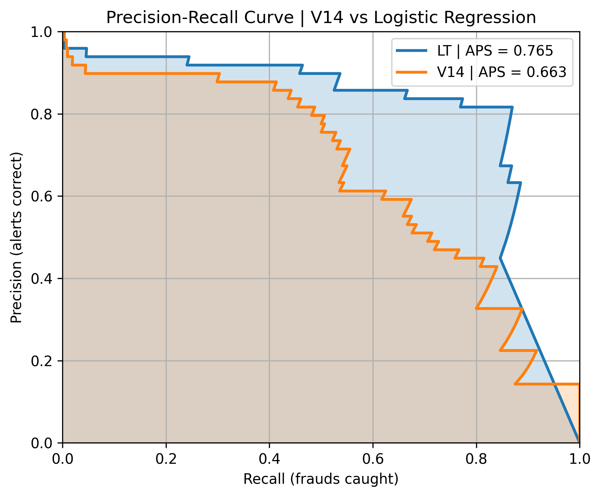
But we can do better.
## Random Forest
I love the random forest algorithm - it's the first algo I learnt that models non-linear relationship and remains intuitive to understand. It uses several decision trees to improve accuracy while staving off overfitting. Random forest achieves this by building deep binary decision trees (which can overfit on training data) and then averaging across these trees. In the fraud detection case, each tree will cycle through a series of features to predict the probability of transaction fraud. Finally, we'll "average" across all trees to get the final probability of fraud.
### Mathematical Intuition
It can be somewhat abstract to visualize a random forest, but we can see one in action. We can train a forest with limited depth (3) to see one of the decision trees.
```python
# initialize model
rf = RandomForestClassifier(
    n_estimators = 100,
    max_depth = 3,
    class_weight = 'balanced',
    n_jobs = -1, # use all processors
    random_state = SEED
)

# train
rf.fit(X_train, y_train)
```
This creates 100 decision trees (`n_estimators`), of which we can visualize one
```python
# visualize one tree
print('Single Decision Tree')
print(export_text(rf.estimators_[0], feature_names=list(X_train.columns)))
```

```
Single Decision Tree
|--- V14 <= -1.81
|   |--- V11 <= 0.16
|   |   |--- V17 <= 0.72
|   |   |   |--- class: 0.0
|   |   |--- V17 >  0.72
|   |   |   |--- class: 1.0
|   |--- V11 >  0.16
|   |   |--- V4 <= 0.09
|   |   |   |--- class: 0.0
|   |   |--- V4 >  0.09
|   |   |   |--- class: 1.0
|--- V14 >  -1.81
|   |--- V23 <= 0.49
|   |   |--- V20 <= -1.02
|   |   |   |--- class: 1.0
|   |   |--- V20 >  -1.02
|   |   |   |--- class: 0.0
|   |--- V23 >  0.49
|   |   |--- V16 <= -0.43
|   |   |   |--- class: 1.0
|   |   |--- V16 >  -0.43
|   |   |   |--- class: 0.0
```
Further, we can also visualize the weighted class counts
```python
print('Single Decision Tree Weighted Class Counts')
print(rf.estimators_[0].tree_.value)
```
```
Single Decision Tree Weighted Class Counts
[[[0.50319834 0.49680166)

 [[0.03277628 0.96722372)

 [[0.42479552 0.57520448)

 [[1.         0.        )

 [[0.33258051 0.66741949)

 [[0.02064059 0.97935941)

 [[0.72513906 0.27486094)

 [[0.01295088 0.98704912)

 [[0.87833507 0.12166493)

 [[0.90323313 0.09676687)

 [[0.28813819 0.71186181)

 [[0.9231533  0.0768467 )

 [[0.57044865 0.42955135)

 [[0.28843068 0.71156932)

 [[1.         0.        )]
```
Random forest averages out the probabilities of all these trees to get a final probability of fraud based on the value of each feature.
### Implementation
Now let's implement the actual forest. We'll use 100 trees and make no constraint on the depth.
```python
# actual implementation
rf = RandomForestClassifier(
    n_estimators = 100,
    max_depth = None,
    class_weight = 'balanced',
    n_jobs = -1, # use all processors
    random_state = SEED,
)

# train
rf.fit(X_train, y_train)
```
Next we'll predict fraud using the validation dataset and calculate the average precision score.
```python
# predict probabilities
y_validation_probabilities = rf.predict_proba(X_validation)
y_validation_probabilities = y_validation_probabilities[:, 1] # probabilities of fraud class
# calculate aps
aps_rf = average_precision_score(y_validation, y_validation_probabilities)
print(f"Average APS score: {aps_rf:.3f}")
```
```
Average APS score: 0.869
```
0.869 is another significant leap from the 0.764 we got from logistic regression. The precision-recall curve helps visualize the improved performance too.
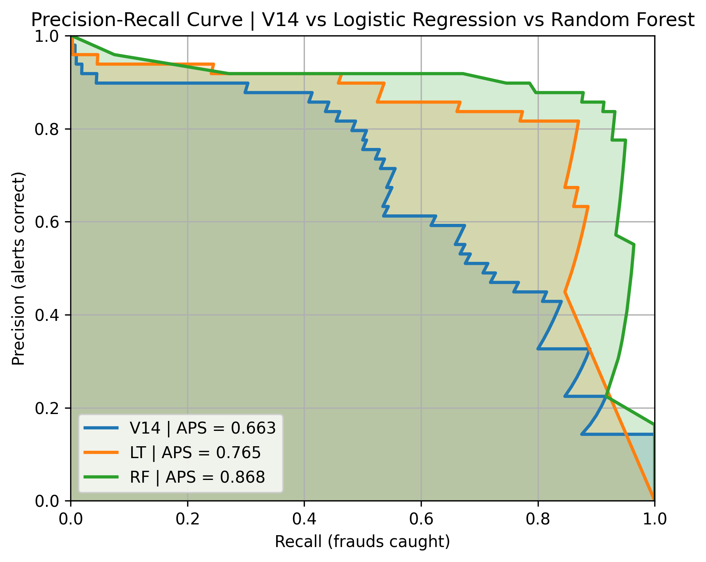
But we can do better.
## XGBoost
We've determined that a model that learns non-linear relationships performs really well compared to linear models. XGBoost is a natural extension of this process. Random forest was a *bagging* model -- each tree was trained on a different subset of the data and we used the "wisdom of the crowd" to obtain the final model. XGBoost is a *boosting* model. It also works off decision trees, but does not train them in parallel. In fact, each tree learns from the *previous* tree to improve itself in a sequence.
### Implementation
While `scikit-learn` provides some tree boosting algorithms, it doesn't actually provide XGBoost. Fortunately, there's a good [Python API](https://xgboost.readthedocs.io/en/stable/python/python_api.html) reference which also offers a `scikit-learn` learning interface (we'll need this to optimize for AUPRC). XGBoost has a *lot* of parameters, so let's start off with a simple model using the default parameters. The only changes we've made here are to

- `scale_pos_weight` - to account for the unbalanced dataset
- `subsample` and `colsample_bytree` - subsampling to reduce overfitting

```python
## initial model training
xgb = XGBClassifier(
    n_estimators = 2000, # number of trees
    max_depth = 6,
    learning_rate = 0.3, # eta
    verbosity = 0,
    gamma = 0,
    min_child_weight = 1,
    max_delta_step = 0,
    subsample = 0.8, # subsample 80% of rows to reduce overfitting
    sampling_method = 'uniform',
    colsample_bytree = 0.8, # subsample 80% of features to reduce dependence on few features
    reg_alpha = 0, # L1 regularization
    reg_lambda = 1, # L2 regularization
    scale_pos_weight = (y_train == 0).sum() / (y_train == 1).sum(), # balance imbalance in dataset
    random_state = SEED,
    eval_metric = 'aucpr',
)

# train
xgb.fit(
    X_train, y_train,
    eval_set = [(X_validation, y_validation)],
    verbose = False,
)
```

Note that we've used the Classifier version because we want probabilities of class prediction. Next we'll compute these probabilities by doing

```python
# predict probabilities
y_validation_probabilities = xgb.predict_proba(X_validation)
y_validation_probabilities = y_validation_probabilities[:, 1] # probabilities of fraud class
```

This gives us a pretty good average precision score, an improvement over random forest.

```
Average APS score: 0.902
```

We can now tune the model by adding more parameters and playing with the learning rate. Each XGBoost model is a result of several sequentially trained trees, so we can tune parameters that impact individual trees for starters. These are

- Learning Rate: The size of each boosting step ("how fast does the tree learn?")
- Maximum depth: The depth of each tree. A "deeper" tree can be highly specific and overfit at the cost of generalization
- Minimum child weight: Controls splitting a tree further, only if there are enough samples to support the split

```python
hyperparameter_space = {
    "learning_rate":    [0.03, 0.05, 0.1],
    "max_depth":        [1, 3, 4, 5, 10],
    "min_child_weight": [1, 2, 4, 10],
}

results = []
for lr in tqdm(hyperparameter_space["learning_rate"], desc='lr', position=0, leave=True):
    for md in tqdm(hyperparameter_space["max_depth"], desc='md', position=1, leave=False):
        for mcw in tqdm(hyperparameter_space["min_child_weight"], desc='mcw', position=2, leave=False):
            model = XGBClassifier(
                n_estimators = 2000, # number of trees
                max_depth = md,
                learning_rate = lr, # eta
                verbosity = 0,
                gamma = 0,
                min_child_weight = mcw,
                max_delta_step = 0,
                subsample = 0.8, # subsample 80% of instances to reduce overfitting
                sampling_method = 'uniform',
                colsample_bytree = 0.8, # subsample 80% of features to reduce dependence on few features
                reg_alpha = 0, # L1 regularization
                reg_lambda = 1, # L2 regularization
                scale_pos_weight = (y_train == 0).sum() / (y_train == 1).sum(), # balance imbalance in dataset
                random_state = SEED,
                eval_metric = 'aucpr',
            )
            model.fit(
                X_train, y_train,
                eval_set=[(X_validation, y_validation)],
                verbose=False
            )

            # predict APS
            y_validation_probabilities = model.predict_proba(X_validation)
            y_validation_probabilities = y_validation_probabilities[:, 1] # probabilities of fraud class
            aps = average_precision_score(y_validation, y_validation_probabilities)
            results.append({"learning_rate": lr, "max_depth": md, "min_child_weight": mcw, "val_aps": aps})
```

After 20 minutes of training on my M2 MacBook Air, we have a few models tuned. Let's look at the top ten configs.

```
   learning_rate  max_depth  min_child_weight   val_aps
0           0.03          5                 4  0.909523
1           0.03          5                 2  0.907638
2           0.05          5                 2  0.906969
3           0.03          5                 1  0.906348
4           0.05          4                 1  0.905591
5           0.10          5                 1  0.905561
6           0.10          4                 4  0.904845
7           0.10          4                 1  0.903896
8           0.10          5                 2  0.903676
9           0.03         10                 4  0.903574
```

We saw a small increase in APS which means that the parameter tuning has worked well. We've significantly decreased the learning rate, reduced the tree depth and increased the child weights to require a higher standard to split the tree.

As an additional step, we want to expand our grid search to regularization parameters to help generalize the model further while controlling for overfitting. Expanding the grid will take far too much time to train the model on my laptop, so we'll implement early stopping rounds. Early stopping can help fix overfitting by stopping the tree building early, but crucially, it'll also allow us to run through individual model fits faster. If we stop the model too fast, we'll underfit and lose precision. A quick loop over our best model in the previous step with some choices for stopping rounds shows that APS plateaus between 70 and 80 early stopping rounds. Increasing stopping rounds from here does not improve the APS meaningfully. Our model with the current parameter selection hits a best APS score at 1116 iterations.

```
    early_stopping_rounds  best_iteration  num_boosted_rounds   val_aps
0                      10              23                  34  0.756005
1                      20              38                  59  0.756922
2                      30              38                  69  0.756922
3                      40             413                 454  0.891754
4                      50             413                 464  0.891754
5                      60             865                 926  0.909170
6                      70             947                1018  0.910246
7                      80            1026                1107  0.910803
8                      90            1116                1207  0.910954
9                     100            1116                1217  0.910954
10                    110            1116                1227  0.910954
11                    120            1116                1237  0.910954
12                    130            1116                1247  0.910954
13                    140            1116                1257  0.910954
14                    150            1116                1267  0.910954
15                    160            1116                1277  0.910954
16                    170            1116                1287  0.910954
17                    180            1116                1297  0.910954
18                    190            1116                1307  0.910954
```

We'll use 80 early stopping rounds around with our previously found hyperparameters to tune the regularization parameters. Note that ideally, we'd tune all the parameters as part of the same grid search, but the space becomes too large for my computer to handle (quick back-of-the-envelope math showed ~44 hours of training).

Setting the hyperparameter space and tuning...

```python
hyperparameter_space = {
    "reg_alpha":        [0.0, 0.1, 0.5],
    "reg_lambda":       [0.5, 1.0, 2.0, 5.0],
    "gamma":            [0.0, 0.1, 1.0],
}
hyperparameters = list(ParameterGrid(hyperparameter_space))

results = []
for hyperparameters in tqdm(hyperparameters):
    model = XGBClassifier(
        n_estimators = 2000, # number of trees
        max_depth = tune_df['max_depth'][0],
        learning_rate = tune_df['learning_rate'][0], # eta
        verbosity = 0,
        n_jobs = -1,
        min_child_weight = tune_df['min_child_weight'][0],
        max_delta_step = 0,
        subsample = 0.8, # subsample 80% of instances to reduce overfitting
        sampling_method = 'uniform',
        colsample_bytree = 0.8, # subsample 80% of features to reduce dependence on few features
        scale_pos_weight = (y_train == 0).sum() / (y_train == 1).sum(), # balance imbalance in dataset
        random_state = SEED,
        eval_metric = 'aucpr',
        early_stopping_rounds = optimal_early_stopping_rounds,
        **hyperparameters
    )
    model.fit(
        X_train, y_train,
        eval_set=[(X_validation, y_validation)],
        verbose=False
    )

    # predict APS
    y_validation_probabilities = model.predict_proba(X_validation)
    y_validation_probabilities = y_validation_probabilities[:, 1] # probabilities of fraud class
    aps = average_precision_score(y_validation, y_validation_probabilities)
    results.append({
        "reg_alpha": hyperparameters['reg_alpha'],
        "reg_lambda": hyperparameters['reg_lambda'],
        "gamma": hyperparameters['gamma'],
        "val_aps": aps
    })
```

we get

```
   reg_alpha  reg_lambda  gamma   val_aps
0        0.1         0.5    0.0  0.911228
1        0.1         2.0    1.0  0.911108
2        0.0         1.0    0.0  0.910954
3        0.0         0.5    0.0  0.910767
4        0.0         2.0    0.1  0.910682
5        0.5         1.0    0.1  0.910546
6        0.1         0.5    0.1  0.909356
7        0.5         2.0    0.1  0.908898
8        0.0         0.5    1.0  0.908697
9        0.0         5.0    0.1  0.908433
```

Finally, we have our "best" model, which has an APS of 0.911.

Visualizing this model's AUPRC compared to previous models shows that XGBoost is more precise at higher recalls when compared to Random Forests.

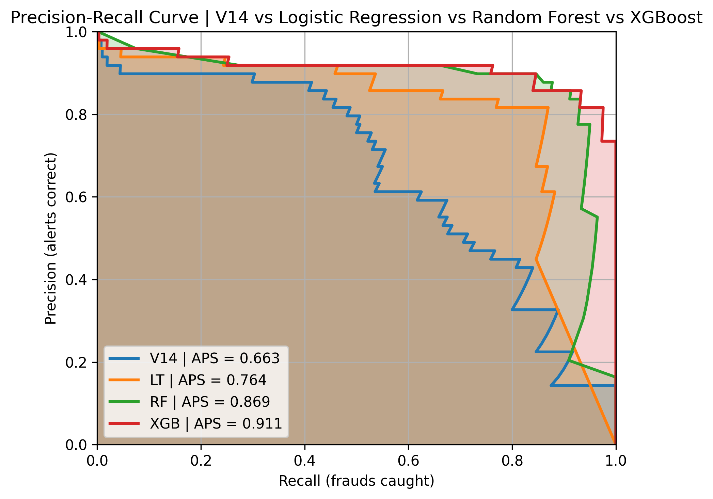

Further we can also compare our models' APS on the validation set. Every version improves on the APS.
## Test set evaluation
Finally, we evaluate all our models on the test set to ensure that their performance holds


## Summary
We cleaned up an imbalanced dataset with fraudulent credit card transactions by log-transforming Amount and adding temporal intelligence to Time. We established a baseline average precision score of 0.61 (on the validation set) using the best dataset feature available. Further, we implemented three classic machine learning models - logistic regression learnt a linear relationship and random forest and XGBoost learnt a non-linear relationship. We netted out with an average precision score of 0.911, a significant improvement from the 0.567 exhibited by the V14 feature on the test set. We could've squeezed more out of the XGBoost model by doing a more exhaustive grid search on parameters, but we were limited by technological constraints.

[^1]: MLG says we should prefer AUPRC over AUROC because of the class imbalance, however McDermott et. al. [argue](https://arxiv.org/abs/2401.06091) that this widely-held assumption may not actually be true. Nevertheless, we take MLG's recommendation.
